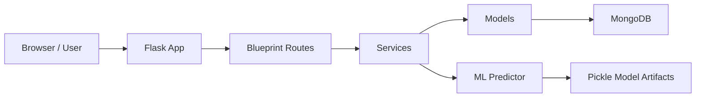
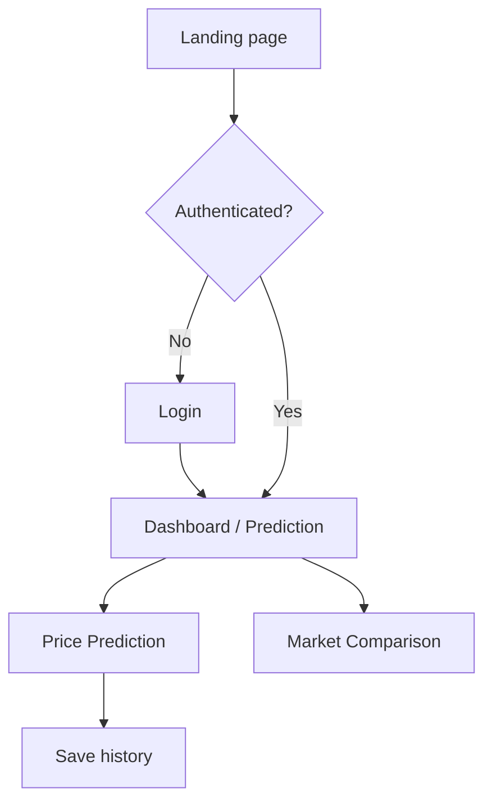
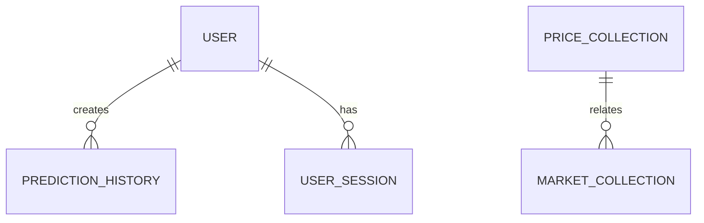
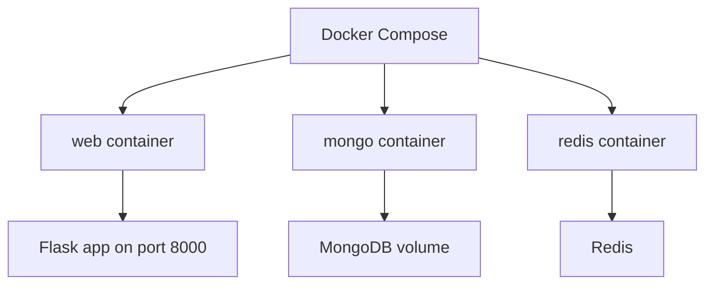

# AgroPulse - Complete Project Documentation

Generated from source inspection of the repository.

## 1. Executive Summary

- Project name: AgroPulse
- Purpose: AgroPulse is a Flask-based web application for Indian agricultural commodity market intelligence. It helps users explore mandi prices, compare market opportunities, and obtain short-term crop price predictions.
- Main features:
  - Landing page and dashboard experience
  - Price comparison views
  - AI-assisted price prediction with confidence intervals
  - User authentication and password reset flow
  - Prediction history for authenticated users
  - MongoDB-backed persistence for prices, markets, users, and prediction history
- Target users:
  - Farmers seeking better selling decisions
  - Traders monitoring market conditions
  - Analysts and developers experimenting with price prediction
- Business workflow:
  1. User browses the landing page or logs in.
  2. User selects a crop, district, and state.
  3. The application retrieves market data and runs a prediction workflow.
  4. The system returns recommendations and future price ranges.
  5. Authenticated users can save and view prediction history.
- Technology stack:
  - Backend: Flask, Flask-CORS, Flask-Limiter, Flask-Mail, Python
  - Database: MongoDB via PyMongo
  - ML: scikit-learn, pandas, numpy, joblib
  - Frontend: server-rendered HTML templates, vanilla JavaScript, CSS, Chart.js
  - Deployment: Docker, Docker Compose, Gunicorn

## 2. Repository Structure

### Folder tree

```text
AgroPulse/
├── app.py
├── config.py
├── requirements.txt
├── README.MD
├── DEPLOY.md
├── Dockerfile
├── docker-compose.yml
├── Makefile
├── .env.example
├── add_user.py
├── create_test_user.py
├── fix_user.py
├── logs/
├── ml/
│   ├── data/
│   │   └── mandi_prices.csv
│   ├── feature_engineering.py
│   ├── predict.py
│   ├── train_model.py
│   └── ... model artifact files (if present in runtime)
├── models/
│   ├── market.py
│   ├── predict.py
│   ├── price.py
│   └── __init__.py
├── routes/
│   ├── auth_routes.py
│   ├── mandi_routes.py
│   ├── market_routes.py
│   ├── prediction_routes.py
│   ├── price_routes.py
│   └── __init__.py
├── scripts/
│   ├── create_indexes.py
│   └── populate_db.py
├── services/
│   ├── prediction_service.py
│   ├── price_service.py
│   ├── recommendation_service.py
│   └── __init__.py
├── static/
│   ├── css/
│   └── js/
├── templates/
├── tests/
├── utils/
│   ├── db_connection.py
│   ├── helpers.py
│   ├── logger.py
│   └── validators.py
```

### Purpose of each major folder

- [app.py](app.py): Application factory and route registration.
- [config.py](config.py): Environment-driven configuration and supported crop/state constants.
- [routes/](routes): Flask blueprints for auth, prediction, mandi, price, and market endpoints.
- [services/](services): Business logic wrappers for price access, predictions, and recommendations.
- [models/](models): Persistence abstractions for MongoDB collections.
- [utils/](utils): Shared helpers for database access, logging, validation, and formatting.
- [ml/](ml): Training, feature engineering, and inference logic for the prediction model.
- [templates/](templates): Server-rendered HTML pages for the UI.
- [static/](static): CSS and JavaScript assets shared across pages.
- [scripts/](scripts): Database index creation and sample data population scripts.
- [logs/](logs): Runtime log output directory.

### Important files and purposes

- [README.MD](README.MD): User-facing overview, quick start, and basic API reference.
- [requirements.txt](requirements.txt): Python dependencies.
- [DEPLOY.md](DEPLOY.md): Deployment instructions.
- [Dockerfile](Dockerfile): Production container definition.
- [docker-compose.yml](docker-compose.yml): Local stack for web, MongoDB, and Redis.
- [Makefile](Makefile): Local development and Docker helpers.
- [.env.example](.env.example): Expected environment variables.
- [routes/auth_routes.py](routes/auth_routes.py): Registration, login, email verification, password reset, logout.
- [routes/prediction_routes.py](routes/prediction_routes.py): Prediction requests, history, model metadata.
- [routes/price_routes.py](routes/price_routes.py): Price retrieval endpoints with validation and formatting.
- [routes/market_routes.py](routes/market_routes.py): Market list endpoints.
- [routes/mandi_routes.py](routes/mandi_routes.py): CSV-backed mandi comparison endpoint.
- [services/price_service.py](services/price_service.py): Current price retrieval and price statistics.
- [services/prediction_service.py](services/prediction_service.py): Prediction orchestration and caching.
- [services/recommendation_service.py](services/recommendation_service.py): Recommendation logic.
- [models/price.py](models/price.py): Price collection access.
- [models/market.py](models/market.py): Market collection access.
- [models/predict.py](models/predict.py): Prediction persistence.
- [scripts/create_indexes.py](scripts/create_indexes.py): MongoDB collection index management.
- [scripts/populate_db.py](scripts/populate_db.py): Sample data generation for development.
- [ml/train_model.py](ml/train_model.py): Training pipeline for the price model.
- [ml/predict.py](ml/predict.py): Runtime inference entry point.
- [ml/feature_engineering.py](ml/feature_engineering.py): Feature preparation for ML experiments.
- [templates/](templates): UI templates for marketing, dashboard, prediction, comparison, auth, history, and about pages.
- [static/js/site.js](static/js/site.js): Shared browser helpers for navigation, alerts, auth checks.
- [static/js/utils.js](static/js/utils.js): Fetch and error handling helpers.
- [static/js/prediction_metadata.js](static/js/prediction_metadata.js): Metadata loading for prediction UI.

### Architecture overview

The system follows a lightweight layered architecture:



### Dependency map

- [app.py](app.py) creates the Flask app and wires blueprints.
- [routes/auth_routes.py](routes/auth_routes.py) imports [utils/logger.py](utils/logger.py) and uses [app.py](app.py) limiter.
- [routes/prediction_routes.py](routes/prediction_routes.py) calls [ml/predict.py](ml/predict.py) for predictions and stores history via [models/predict.py](models/predict.py).
- [routes/price_routes.py](routes/price_routes.py) depends on [services/price_service.py](services/price_service.py), [services/prediction_service.py](services/prediction_service.py), [services/recommendation_service.py](services/recommendation_service.py), and [utils/validators.py](utils/validators.py).
- [models/price.py](models/price.py), [models/market.py](models/market.py), and [models/predict.py](models/predict.py) all depend on [utils/db_connection.py](utils/db_connection.py).
- [scripts/create_indexes.py](scripts/create_indexes.py) depends on [utils/db_connection.py](utils/db_connection.py) and [config.py](config.py).

## 3. Frontend Analysis

### 3.1 Frontend architecture

- Framework used: No SPA framework is used. The UI is server-rendered HTML with Flask templates and lightweight vanilla JavaScript.
- State management: Minimal state is managed in the browser DOM and session cookies. There is no dedicated state store.
- Routing structure: Server-side routes in [app.py](app.py) render pages; client-side navigation uses simple URL changes and `window.location.assign` from [static/js/site.js](static/js/site.js).
- Component hierarchy: Pages are mostly standalone templates, with shared navbar/footer patterns and common CSS/JS helpers.
- Reusable components:
  - Navigation bar and footer repeated across templates
  - Shared alert/loading helpers in [static/js/site.js](static/js/site.js)
  - Shared CSS variables and utility classes in [static/css/site.css](static/css/site.css)
- Design patterns:
  - Server-rendered templates with progressive enhancement via JavaScript
  - Inline page-specific CSS for each template, plus shared styles
  - Fetch-based client requests for APIs

### 3.2 Screens and pages

| Page | Route | Purpose | Main user actions | Components used | Data sources |
|---|---|---|---|---|---|
| Home | `/` | Marketing and introduction | Browse product overview, navigate to login/dashboard | Navbar, hero section, cards, CTA | Static content |
| Login | `/login` | Authentication entry point | Enter credentials, submit login | Form, alerts, spinner | [routes/auth_routes.py](routes/auth_routes.py) |
| Forgot password | `/forgot-password` | Reset initiation | Submit email | Form and alert | [routes/auth_routes.py](routes/auth_routes.py) |
| Reset password | `/password-reset/<token>` | Password update | Enter new password | Form and alert | [routes/auth_routes.py](routes/auth_routes.py) |
| Dashboard | `/dashboard` | Main authenticated view | Review recommendations and useful summary info | Cards and buttons | Static placeholder content currently |
| Prediction | `/prediction` | Price forecast UI | Select state, district, crop; analyze price forecast | Cascading dropdowns, chart, recommendation card | [routes/prediction_routes.py](routes/prediction_routes.py) |
| History | `/history` | View saved predictions | Review prior prediction requests | Card container | [routes/prediction_routes.py](routes/prediction_routes.py) |
| Comparison | `/comparison` | Compare crop market prices | Select crop, view market table | Table and sort controls | [routes/mandi_routes.py](routes/mandi_routes.py) and static sample data |
| About | `/about` | Product and FAQ information | Read product information and contact details | FAQ/statements/form | Static content |

### 3.3 Wireframes

#### Home page

```text
------------------------------------------------
Header: AgroPulse | Home | Dashboard | Compare |
------------------------------------------------
Hero banner with headline and CTA
Two-column/three-card solution overview
Footer
------------------------------------------------
```

#### Login page

```text
------------------------------------------------
Centered card
Title: AgroPulse
Subtitle: Login to your account
Email input
Password input
Login button
Forgot password / Sign up links
------------------------------------------------
```

#### Dashboard page

```text
------------------------------------------------
Header
Welcome banner
Card grid:
- Crop
- Nearest Mandi
- Best Market Price
- Markets Compared
- Recommendation
- Trend
Action buttons
Footer
------------------------------------------------
```

#### Prediction page

```text
------------------------------------------------
Header
Hero title and description
Filter card:
- State dropdown
- District dropdown
- Crop dropdown
- Analyze button
Recommendation card
Chart card with 7-day forecast and confidence area
Footer
------------------------------------------------
```

#### Comparison page

```text
------------------------------------------------
Header
Crop selector
Table with columns:
- Crop
- Market
- Price
- Distance
- Type
- Status
Sort buttons
Footer
------------------------------------------------
```

#### History page

```text
------------------------------------------------
Header
Card with heading and empty/loaded history list
Footer
------------------------------------------------
```

#### About page

```text
------------------------------------------------
Header
Hero section
Content sections with bullet points and FAQ
Contact form
Footer
------------------------------------------------
```

### 3.4 UI/UX analysis

- User flow:



- Navigation flow:
  - Top navigation links are present across templates and route to the main app areas.
  - Auth flow redirects unauthenticated users to the login page via [static/js/utils.js](static/js/utils.js).
- Information architecture:
  - It uses a shallow structure with a few core pages and a small number of API endpoints.
  - Pages are mostly task-oriented rather than deeply nested.
- UX strengths:
  - Clear visual hierarchy with bold green brand accents.
  - Simple layout for non-technical users.
  - Prediction experience is guided by dropdown selections and immediate feedback.
- UX weaknesses:
  - Some screens appear to be static placeholders rather than fully data-driven.
  - There is no registration page in the UI despite backend support.
  - The app uses several inline styles instead of a single maintainable design system.

### 3.5 Design system

#### Colors

| Role | Value | RGB | Usage |
|---|---|---|---|
| Primary green | #22c55e | 34,197,94 | Buttons, active links, success states |
| Dark green | #16a34a | 22,163,74 | Hover state for primary buttons |
| Navigation background | #0f172a | 15,23,42 | Header/nav bar |
| Page background | #f1f5f9 | 241,245,249 | Overall page background |
| Card background | #ffffff | 255,255,255 | Cards and panels |
| Muted text | #64748b | 100,116,139 | Secondary text |
| Error/red | #fee2e2 / #dc2626 | 254,226,226 / 220,38,38 | Error states |
| Success light | #dcfce7 | 220,252,231 | Success state |

#### Typography

- Font family: Arial, Helvetica, sans-serif in most templates.
- Heading size examples:
  - Hero heading: 2.6rem to 3rem
  - Section titles: 2.4rem
  - Card titles: around 1.5rem to 2rem
- Font weights: normal, bold, 700.
- Line heights: around 1.6.

#### Spacing system

- Standard padding: 8px, 12px, 15px, 20px, 25px, 30px, 40px.
- Border radius: 6px, 8px, 10px, 14px, 16px.
- Box shadows: used consistently for card elevation.
- Grid: CSS grid and flexbox are used for layout, with responsive fit patterns.

#### Components

- Buttons: green filled buttons with hover transition; used for primary actions.
- Inputs: rounded fields with border and focus color using the green brand.
- Cards: white background with subtle shadow and rounded corners.
- Tables: simple bordered table with alternating hover highlight.
- Navigation: top bar with links and active-state highlighting.
- Alerts: success/error banners in auth pages.

#### Responsive design

- Breakpoints: Not formally defined in a framework; responsive behavior is achieved with flex/grid and `max-width` containers.
- Mobile: stacked forms and full-width buttons.
- Tablet: responsive card grids adapt to available width.
- Desktop: wider containers and multi-column card grids.

### 3.6 Design recreation guide

A designer could recreate the UI from scratch by using:

- The green palette defined in [static/css/site.css](static/css/site.css).
- The reusable navbar structure used in [templates/index.html](templates/index.html) and [templates/dashboard.html](templates/dashboard.html).
- The centered auth-card style from [templates/login.html](templates/login.html).
- The prediction page layout and chart card from [templates/prediction.html](templates/prediction.html).
- The comparison table layout from [templates/comparison.html](templates/comparison.html).

## 4. Backend Analysis

### 4.1 Backend architecture

- Framework: Flask.
- Layered architecture:
  - Routes layer: [routes/](routes)
  - Service layer: [services/](services)
  - Model layer: [models/](models)
  - Data access utilities: [utils/db_connection.py](utils/db_connection.py)
- Services:
  - [services/price_service.py](services/price_service.py)
  - [services/prediction_service.py](services/prediction_service.py)
  - [services/recommendation_service.py](services/recommendation_service.py)
- Controllers: Flask route handlers in [routes/](routes)
- Middleware: Flask-Limiter and CORS are initialized in [app.py](app.py).
- Utilities:
  - [utils/helpers.py](utils/helpers.py)
  - [utils/validators.py](utils/validators.py)
  - [utils/logger.py](utils/logger.py)

### 4.2 Request flow

```text
Client
→ Route handler in routes/
→ Flask middleware / limiter / session / CORS
→ Service logic in services/
→ Model layer in models/
→ MongoDB or ML model artifact
→ JSON/HTML response
```

### 4.3 API documentation

#### Health

- GET /health
- Purpose: Health check and readiness report.
- Authentication: None.
- Response: status, model_loaded, db_connected.

#### Page routes

- GET /
- GET /login
- GET /forgot-password
- GET /password-reset/<token>
- GET /dashboard
- GET /prediction
- GET /history
- GET /comparison
- GET /about
- Purpose: Render HTML templates.
- Authentication: Some pages require login client-side.

#### Authentication endpoints

- POST /api/auth/login
  - Purpose: Authenticate user and create session.
  - Request body: email, password.
  - Response: success, message, user.
  - Errors: 400, 401, 500.

- POST /api/auth/register
  - Purpose: Create a user and send verification email.
  - Request body: name, email, password.
  - Response: success, message.
  - Errors: 400, 409, 500.

- GET /api/auth/verify/<token>
  - Purpose: Mark a user as verified.
  - Authentication: None.
  - Response: redirect to /login?verified=1.

- POST /api/auth/resend-verification
  - Purpose: Resend verification email.
  - Request body: email.

- POST /api/auth/logout
  - Purpose: Clear session.

- POST /api/auth/forgot-password
  - Purpose: Send a password reset email.
  - Request body: email.

- POST /api/auth/reset-password
  - Purpose: Reset password using a signed token.
  - Request body: token, new_password, confirm_password.

- GET /api/auth/check
  - Purpose: Return current authentication status.

#### Prediction endpoints

- POST /api/predict
  - Purpose: Run prediction and optionally save history.
  - Request body: crop, location, state, quantity, district.
  - Response: prediction payload with predicted prices, upper/lower bounds, recommendation, gain, market, trend, confidence.

- GET /api/predict/history
  - Purpose: Return prediction history for the authenticated user.
  - Authentication: Required.

- DELETE /api/predict/history/<history_id>
  - Purpose: Delete one prediction history record.
  - Authentication: Required.

- GET /api/predict/model-info
- GET /api/predict/metadata
  - Purpose: Return supported states, districts, crops, and mapping metadata.
  - Authentication: None.

#### Price endpoints

- POST /api/prices
  - Purpose: Get current prices, prediction, recommendation, and statistics.
  - Request body: crop, location, quantity.

- GET /api/prices/current
  - Purpose: Return current prices for a crop and location.

- GET /api/prices/statistics
  - Purpose: Return price statistics for a crop and location.

#### Market endpoints

- GET /api/markets
  - Purpose: List markets with optional district/type filters.

- GET /api/markets/<district>
  - Purpose: List markets within a district.

#### Mandi endpoint

- GET /api/mandi/compare
  - Purpose: Return comparison-style mandi prices from CSV data.
  - Query parameter: crop.

### 4.4 Business logic

- Core workflows:
  - Prediction workflow: select crop and location → call ML inference or fallback → return recommendation → optionally store history.
  - Price workflow: validate request → fetch current prices → fetch prediction → generate recommendation → return enhanced response.
  - Auth workflow: register → verify email → login → session → password reset.
- Validation rules:
  - Crop values are validated against [config.py](config.py) supported crops.
  - Passwords must be at least 8 characters.
  - Quantity must be positive and under 10,000 in [utils/validators.py](utils/validators.py).
- Permissions:
  - Prediction history is protected by session-based auth.
  - Unauthenticated requests receive 401 responses.
- Authorization:
  - No role-based roles or permission matrix are present; auth is effectively a single-user or any-verified-user model.
- Background jobs:
  - Not Found. No scheduled jobs or Celery workers were discovered.
- Event processing:
  - Email sending on registration/reset; no event bus or queue is implemented.

### 4.5 Security review

- Authentication: session-based, backed by Flask sessions and MongoDB user records.
- Authorization: simple session presence check; no RBAC.
- JWT/session flow: Flask session cookies are used, not JWT.
- Security strengths:
  - Passwords are hashed with bcrypt.
  - Email verification is enforced for login.
  - Limiter is configured in [app.py](app.py).
- Security concerns / recommended improvements:
  - CSRF protection is not explicitly implemented for state-changing forms.
  - The app uses a default development secret in [config.py](config.py) unless overridden.
  - Mail credentials and secrets must be configured via environment variables.
  - CORS origins are permissive by default and may need tightening.
  - No explicit rate-limit strategy beyond Flask-Limiter and no Redis-backed storage in development.

## 5. Database Analysis

### 5.1 Database overview

- Database type: MongoDB.
- ORM used: None; PyMongo is used directly.
- Connection strategy: Singleton connection manager in [utils/db_connection.py](utils/db_connection.py); app also creates a Mongo client in [app.py](app.py).

### 5.2 Entity relationship diagram



### 5.3 Collections / entities

#### users

- Purpose: Stores user profile, password hash, verification status, and password reset version.
- Key fields observed: name, email, password, verified, created_at, password_reset_version.

#### prices

- Purpose: Historical price records for crops, districts, mandis, and dates.
- Typical fields observed: crop, mandi_name, district, state, modal_price, min_price, max_price, date, arrival_quantity, type, created_at.

#### markets

- Purpose: Market metadata such as district, location, type, crops accepted, and contact info.
- Typical fields observed: mandi_name, district, state, type, location, contact, crops_accepted, timings, facilities.

#### predictions

- Purpose: Stores machine-learning prediction records for recent requests.
- Typical fields observed: crop, location, predicted_prices, trend, optimal_day, confidence, current_price, created_at.

#### prediction_history

- Purpose: Stores history of predictions made by authenticated users.
- Typical fields observed: user_id, crop, state, district, quantity, predicted_prices, upper_bound, lower_bound, recommendation, expected_gain, best_market, confidence, trend, created_at.

### 5.4 Data flow

- Prediction request flow:
  1. User submits crop, state, district, and optional quantity from `/prediction`.
  2. Browser sends POST to `/api/predict`.
  3. `routes/prediction_routes.py` validates the payload and calls `ml/predict.py`.
  4. If the trained model is available, it returns a 7-day forecast and confidence band.
  5. If the user is authenticated, the prediction is also persisted in `prediction_history`.
  6. The frontend renders the result into the recommendation card and chart.

- Price request flow:
  1. The user requests current prices or uses a price comparison page.
  2. If the browser uses `/api/prices`, `routes/price_routes.py` validates the request.
  3. `services.price_service.PriceService` retrieves current price documents from `models.price.PriceModel`.
  4. `services.prediction_service.PredictionService` may fetch or compute a prediction.
  5. `services.recommendation_service.RecommendationService` generates a sell/wait recommendation.
  6. Response is returned with combined current prices, prediction, recommendation, and statistics.

- Mandi comparison flow:
  1. Browser requests `/api/mandi/compare?crop=<crop>`.
  2. `routes/mandi_routes.py` reads `ml/data/mandi_prices.csv` and filters by crop.
  3. Results are returned as serialized market rows.

- Metadata flow:
  1. `/api/predict/model-info` and `/api/predict/metadata` provide supported crops, states, and district mappings.
  2. The prediction UI consumes this metadata to populate dropdowns.

### 5.5 Migrations and schema maintenance

- There is no formal migration framework or versioned schema migration file set in the repository.
- `scripts/create_indexes.py` is the only schema maintenance helper and can be used to create collection indexes.
- The `Makefile` references `ml/data_pipeline.py`, but that file is not present in the repository. This indicates an incomplete setup or a missing data ingestion artifact.

## 6. Authentication & Authorization

### Login flow

- Endpoint: `POST /api/auth/login`
- Validates user credentials via the `users` collection.
- Uses `bcrypt` to compare password hashes.
- Requires email verification before success.
- On success, sets `session['user_id']`, `session['email']`, and `session['name']`.

### Registration flow

- Endpoint: `POST /api/auth/register`
- Validates name, email, and password length.
- Creates a new `users` document with `verified: False`.
- Generates an email verification token and sends it via Flask-Mail or logs it if mail service is unavailable.

### Password reset flow

- Endpoint: `POST /api/auth/forgot-password`
- Generates and sends a reset token to the user email if the account exists.
- Endpoint: `POST /api/auth/reset-password`
- Validates the token and resets the password after confirming the new password.
- Uses a versioned token strategy with `password_reset_version` to invalidate old tokens.

### Session handling

- Session cookies are configured with `HttpOnly` and `SameSite='Lax'`.
- `SESSION_COOKIE_SECURE` is enabled in production mode.
- Auth state is determined by the existence of `session['user_id']`.

### Authorization model

- No role management or authorization beyond authenticated sessions is implemented.
- Protected endpoints:
  - `GET /api/predict/history`
  - `DELETE /api/predict/history/<history_id>`
- Public endpoints include predictions, prices, markets, and mandi comparison.

### Permission matrix

| Endpoint | Auth required | Notes |
|---|---|---|
| `POST /api/auth/register` | No | open registration |
| `POST /api/auth/login` | No | login |
| `POST /api/auth/logout` | Yes | clears session |
| `POST /api/auth/forgot-password` | No | request reset |
| `POST /api/auth/reset-password` | No | reset with token |
| `GET /api/auth/check` | No | auth status |
| `POST /api/predict` | No | public prediction |
| `GET /api/predict/history` | Yes | history retrieval |
| `DELETE /api/predict/history/<id>` | Yes | delete history item |
| `GET /api/markets` | No | public market list |
| `GET /api/mandi/compare` | No | public CSV-backed comparison |

## 7. Third-Party Integrations

- MongoDB: primary datastore, configured via `MONGO_URI`.
- Redis: used optionally by Flask-Limiter if `REDIS_URL` is provided; otherwise fallback to in-memory rate limiting.
- Flask-Mail: email delivery for verification and password reset.
- Chart.js: client-side chart rendering in prediction UI.
- Bootstrap CDN: layout and responsive utilities in the prediction page.
- Font Awesome CDN: iconography on the prediction page.
- requests: used in `scripts/update_mandi_data.py` and test scripts.

## 8. Deployment Architecture

### Environment variables

- `SECRET_KEY`
- `MONGO_URI`
- `DATABASE_NAME`
- `CORS_ORIGINS`
- `REDIS_URL`
- `BASE_URL`
- `LOG_LEVEL`
- `MAIL_SERVER`
- `MAIL_PORT`
- `MAIL_USERNAME`
- `MAIL_PASSWORD`
- `MAIL_DEFAULT_SENDER`
- `FLASK_ENV`
- `MONGO_URI_TEST`

### Build and run

- Local development: create a Python virtual environment and install dependencies from `requirements.txt`.
- Docker: build with `docker build -t agropulse .`.
- Docker Compose: start all services with `docker compose up --build`.

### Container architecture

- `web`: Flask application served by Gunicorn.
- `mongo`: MongoDB database.
- `redis`: Redis cache for rate limiting.

### Production readiness

- A Docker-based deployment is supported via `Dockerfile` and `docker-compose.yml`.
- No CI/CD pipeline definitions were found in the repository.
- No cloud infrastructure templates exist.

## 9. Code Quality Review

### Observations

- Several static asset files are present but empty or mostly placeholder:
  - `static/js/main.js`
  - `static/js/charts.js`
  - `static/css/style.css`
  - `static/css/responsive.css`
- `ml/predict.py` has a critical import bug: `from turtle import pd` instead of `import pandas as pd`.
- `Makefile` references `ml/data_pipeline.py`, which is missing.
- Some UI pages are implemented with static placeholder content rather than dynamic API-driven data.
- The application does not use a centralized template layout for repeated navbar/footer content.
- Error handling is inconsistent across routes and sometimes returns raw exceptions.

### Technical debt

- No test framework integration; tests are raw Python scripts in the repository root.
- Lack of explicit mobile responsiveness in CSS.
- No schema migration tool for MongoDB beyond index creation.
- Limited security hardening on form endpoints and CSRF protection.
- Absence of monitoring/observability beyond basic logging.

### Performance concerns

- `routes/mandi_routes.py` may read the CSV file on each request, which can be expensive.
- Prediction metadata endpoints may load data and recompute mappings on demand.
- Stateful Flask sessions may hinder horizontal scaling without shared session storage.

### Scalability concerns

- MongoDB is deployed as a single container in compose with no replication.
- Redis is optional, so rate limiting may use an in-memory store in some environments.
- No async workers or background job processing for email or heavy model work.

### Refactoring opportunities

- Consolidate repeated HTML and CSS into shared templates and styles.
- Move client-side form validation into common shared scripts.
- Add a dedicated API response helper and error formatter.
- Extract ML model loading and prediction into a service class with testable boundaries.
- Introduce a migration strategy or schema versioning for MongoDB.

## 10. Rebuild Guide

### Frontend

- Use Flask templates for page rendering.
- Create a shared base template for navbar, footer, and asset links.
- Build the prediction page around a metadata-driven form and Chart.js chart.
- Keep authentication pages simple and route form submissions to the API.

### Backend

- Use `app.py` as the entrypoint and register blueprints for auth, prediction, price, market, and mandi.
- Configure CORS, rate limiting, and mail at app startup.
- Use environment configuration in `config.py`.
- Implement shared validation and helper utilities in `utils/`.

### Database

- Use MongoDB with collections for users, prices, markets, predictions, and prediction_history.
- Create indexes with `scripts/create_indexes.py`.
- Keep documents denormalized for fast read performance.

### APIs

- Support auth, prediction, price, market, and mandi endpoints as documented above.
- Use session-based auth for protected routes.
- Expose metadata endpoints for frontend dropdowns.

### User flows

- Visitor landing page → prediction or comparison.
- Registered user login → dashboard → prediction → history.
- Password reset via email token.

### Infrastructure

- Containerize with Docker.
- Use MongoDB and Redis services in compose.
- Configure secrets through `.env`.
- Run the Flask app under Gunicorn in production.

## 11. Missing Documentation and Gaps

- Missing or incomplete documentation exists for:
  - `scripts/update_mandi_data.py` usage.
  - `scripts/populate_db.py` sample commands.
  - The ML model training artifact shape and required model files.
- Gaps found in the repository:
  - `ml/data_pipeline.py` is referenced in the `Makefile` but not included.
  - `ml/predict.py` import bug likely breaks ML inference.
  - Several UI/data-binding pages are partially implemented or use hard-coded placeholders.
  - No CI/CD, infrastructure-as-code, or cloud deployment documentation.
  - No formal database migration or versioning guidance.

## 12. Conclusion

This repository implements a functioning Flask-based agricultural pricing application with prediction, pricing, and auth workflows. The architecture is lightweight and straightforward, but the codebase contains several incomplete artifacts and documentation gaps.

Key recommendations:
- Fix `ml/predict.py` and verify the prediction model pipeline.
- Add missing `ml/data_pipeline.py` or remove the `Makefile` reference.
- Complete frontend API bindings and shared template layout.
- Add formal tests using a framework like `pytest`.
- Harden security by adding CSRF protection and improving error handling.
- Document deployment and data pipeline steps clearly.

> This documentation is derived from a direct source review of the repository and includes explicit notes on missing files and incomplete implementation areas.


- User input from the UI is posted to the Flask API.
- The backend validates the request and calls the relevant service.
- Price and market data are read from MongoDB collections.
- Prediction results are generated by [ml/predict.py](ml/predict.py) or the fallback logic.
- Authenticated requests save prediction data into the history collection.

### 5.5 Migrations

- Migrations: Not Found.
- Schema evolution is handled implicitly through MongoDB documents and scripts rather than formal schema migrations.
- Index creation is performed by [scripts/create_indexes.py](scripts/create_indexes.py).

## 6. Authentication & Authorization

- Login flow:
  1. User submits email/password to [routes/auth_routes.py](routes/auth_routes.py).
  2. The app looks up the user in MongoDB.
  3. Password is verified with bcrypt.
  4. The user must be verified.
  5. A Flask session is created.
- Registration flow:
  1. User submits name/email/password.
  2. Basic validation is applied.
  3. A new document is created in the users collection.
  4. A signed verification token is created and emailed.
- Password reset:
  1. User requests reset via email.
  2. A signed token is generated and sent.
  3. The reset endpoint validates the token and updates the password.
- Session handling:
  - Flask session cookie is used.
  - Session data includes user_id, email, name.
- Role management:
  - Not Found. The current implementation does not implement roles or permissions beyond authenticated vs unauthenticated.
- Permission matrix:
  - Authenticated user: can view prediction history and submit predictions.
  - Unauthenticated user: can view public pages and can submit prediction endpoints without auth, but history is restricted.

## 7. Third-Party Integrations

| Integration | Purpose | Configuration | Usage | Failure handling |
|---|---|---|---|---|
| MongoDB | Primary data store | [config.py](config.py), [.env.example](.env.example) | Stores users, prices, markets, predictions | Startup logs warning; app still starts with fallback behaviors |
| Flask-Mail | Email delivery | MAIL_SERVER, MAIL_PORT, MAIL_USERNAME, MAIL_PASSWORD, MAIL_DEFAULT_SENDER | Verification and password reset emails | Falls back to logging the link if mail is not configured |
| Chart.js | Frontend charts | Loaded in [templates/prediction.html](templates/prediction.html) | Visualizes 7-day forecasts | Graceful fallback via no chart if script fails |
| Bootstrap | UI styling | Loaded in [templates/prediction.html](templates/prediction.html) | Form and layout styling | Not required for core app function |
| Redis | Rate-limit storage | REDIS_URL in [config.py](config.py) | Optional limiter backend | Defaults to in-memory storage |

## 8. Deployment Architecture

### Environment variables

The application reads configuration from [config.py](config.py) and [.env.example](.env.example). Key variables include:

- FLASK_ENV
- SECRET_KEY
- MONGO_URI
- DATABASE_NAME
- CORS_ORIGINS
- REDIS_URL
- BASE_URL
- LOG_LEVEL
- MAIL_SERVER
- MAIL_PORT
- MAIL_USERNAME
- MAIL_PASSWORD
- MAIL_DEFAULT_SENDER

### Build process

- Python dependencies are installed from [requirements.txt](requirements.txt).
- The app is served by Gunicorn in [Dockerfile](Dockerfile).

### CI/CD

- Not Found. There is no GitHub Actions or pipeline configuration in the repository.

### Docker setup



### Production architecture

- The web service runs behind Gunicorn in a container.
- MongoDB and Redis run as separate services.
- The application is designed for stateless web workers with externalized persistence.

## 9. Code Quality Review

- Code smells:
  - Some modules mix route logic, validation, and persistence concerns.
  - The app uses a mixture of direct Flask route handlers and service/model layers, which sometimes causes duplication.
  - A few scripts rely on hard-coded defaults and local assumptions.
- Technical debt:
  - No formal test framework configuration beyond ad-hoc scripts.
  - Frontend uses a lot of inline styles and duplicated CSS patterns.
  - The prediction UI and backend are partially decoupled, with some hard-coded UI data.
- Performance issues:
  - The ML inference path depends on model artifact files being present.
  - The app currently falls back to random values if the model or data are unavailable.
  - Some routes read CSV data directly rather than relying on MongoDB-backed data.
- Scalability concerns:
  - MongoDB access is straightforward but there is no sharding or advanced indexing strategy beyond basic indexes.
  - Session-based auth is fine for small deployments but not ideal for distributed scale-out without shared session storage.
- Refactoring opportunities:
  - Introduce a more explicit service/controller separation.
  - Move shared frontend styling into a dedicated, maintainable design system.
  - Add automated unit and integration tests.
  - Replace runtime CSV access with a consistent data pipeline.

## 10. Rebuild Guide

### Frontend architecture

- The UI is built from Flask templates under [templates/](templates).
- Shared style is in [static/css/site.css](static/css/site.css).
- Shared JS helpers are in [static/js/site.js](static/js/site.js) and [static/js/utils.js](static/js/utils.js).

### Backend architecture

- Start the app with [app.py](app.py).
- Register new routes through the appropriate blueprint in [routes/](routes).
- Implement business logic in [services/](services).
- Persist data through [models/](models).

### Database schema

- Use MongoDB collections for users, prices, markets, predictions, and prediction_history.
- Initialize indexes using [scripts/create_indexes.py](scripts/create_indexes.py).

### APIs

- Refer to the route definitions in [routes/](routes) for endpoint contracts.
- Client usage examples are available in the templates and tests.

### User flows

- Public flows: landing page → login → dashboard/prediction/comparison.
- Authenticated flows: login → prediction → historical view.

### Design system

- Recreate the visual language from [static/css/site.css](static/css/site.css) and the page templates.

### Infrastructure

- Use [Dockerfile](Dockerfile), [docker-compose.yml](docker-compose.yml), and [Makefile](Makefile) for local deployment.

## 11. Missing Documentation

- Undocumented features: None of the frontend pages are documented in a separate product spec; this report serves as that documentation.
- Hidden dependencies:
  - The prediction flow depends on model artifact files such as [ml/predict.py](ml/predict.py) model pickles being present.
  - Some pages render static placeholders and do not fully reflect live data.
- Assumptions:
  - The repo assumes a running MongoDB instance and a valid environment configuration.
  - The `ml/data/mandi_prices.csv` file is treated as the source for the model training data and the mandi compare endpoint.
- Risks:
  - Missing or incompatible model artifacts may cause prediction fallback behavior.
  - The app is not yet production-hardened with full RBAC, CI/CD, and end-to-end tests.

## 12. Final Deliverables

1. Full Technical Specification: This document.
2. Product Requirement Document (PRD): The product purpose and feature scope are derived from [README.MD](README.MD), [templates/index.html](templates/index.html), and [templates/about.html](templates/about.html).
3. System Design Document: Covered in Sections 2, 4, 5, and 8.
4. API Documentation: Covered in Section 4.3.
5. Database Documentation: Covered in Section 5.
6. Design System Documentation: Covered in Section 3.5.
7. Mermaid Architecture Diagrams: Included in Sections 2, 3.4, and 8.
8. ERD Diagrams: Included in Section 5.2.
9. User Flow Diagrams: Included in Section 3.4.
10. Feature Inventory: Covered throughout Sections 1, 3, 4, and 6.
