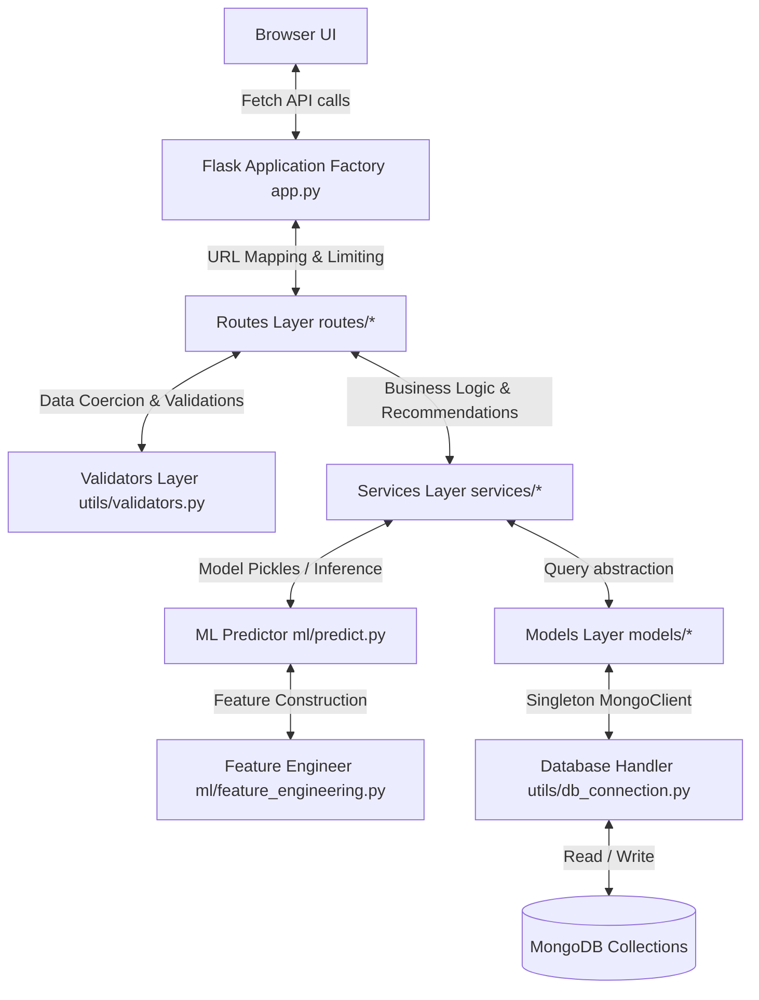
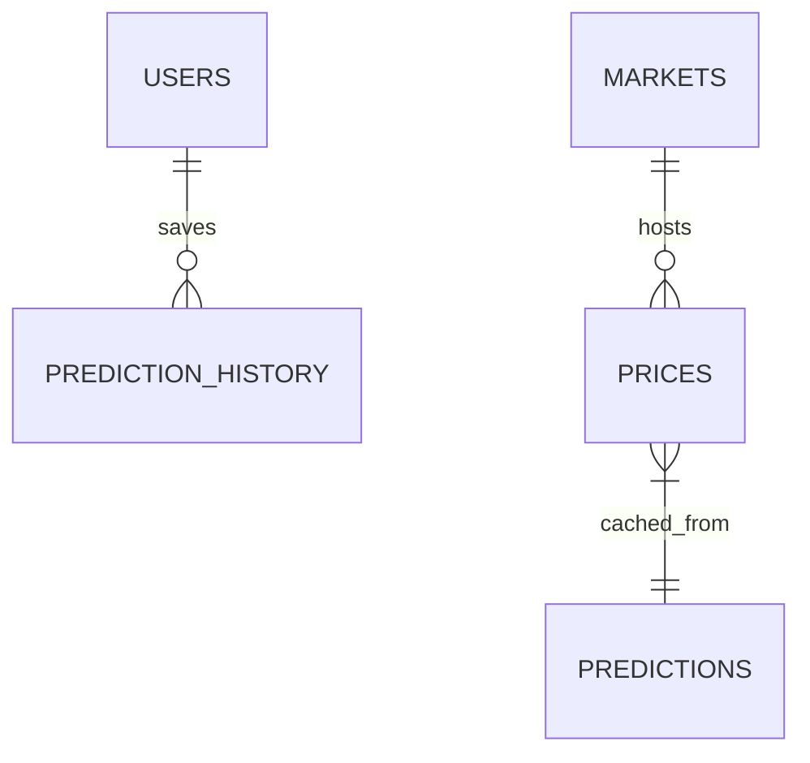
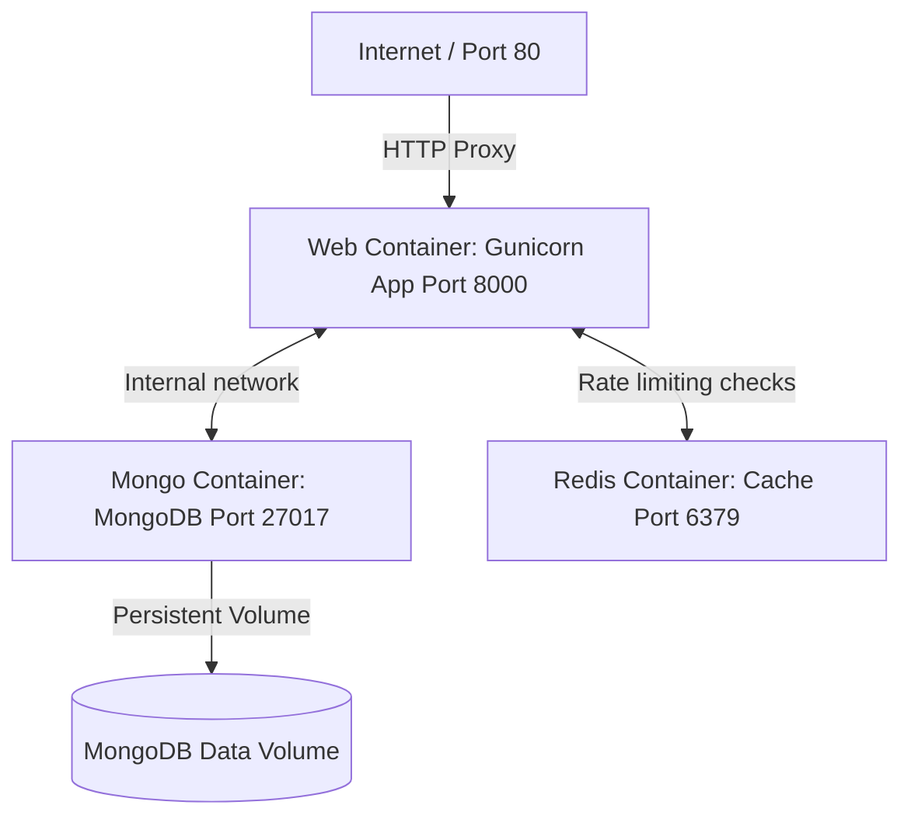

# AgroPulse - Complete Project Documentation

This documentation provides an exhaustive, source-mapped blueprint of the AgroPulse repository. All details are extracted directly from the code files and scripts in the workspace.

---

## 1. Executive Summary

- **Project Name**: AgroPulse
- **Purpose**: AgroPulse is a market intelligence and predictive analysis platform tailored for Indian agricultural commodities. It aims to eliminate information asymmetry and help farmers make informed decisions about when and where to sell their crops.
- **Main Features**:
  - **Landing Page**: Marketing, problem statement breakdown, and public crop lookup.
  - **Farmer Dashboard**: Summarized cards tracking a user's primary crop, nearest mandi, best prices, and quick recommendations.
  - **Price comparison**: A dynamic list comparing prices across multiple mandis.
  - **AI-assisted price prediction**: A 7-day crop price forecast with upper and lower confidence intervals using a trained Random Forest regression model.
  - **User Authentication**: Secure session-based signup, login, email verification, and password reset flows.
  - **Prediction History**: A user-specific log of past price forecast queries.
  - **Mandi Data Update Service**: Script-based ingestion to merge fresh commodity pricing records into the core CSV database without service disruption.
  - **Centralized Database Connection**: Singleton client manager to prevent duplicate connection sockets.
- **Target Users**:
  - **Farmers**: Seeking optimization of crop sale timing and mandi selection.
  - **FPOs (Farmer Producer Organizations)**: Aggregators comparing prices across regions.
  - **Traders/Analysts**: Monitoring price trends and predicting commodity movements.
- **Business Workflow**:
  ```text
  User -> Lands on Homepage -> Logs in / Registers (with Email Verification)
        -> Accesses Dashboard -> Selects Crop, State, & District
        -> System runs ML Inference (falls back to CSV stats if model is absent)
        -> Renders 7-day Price Forecast (Chart.js) and recommendations (Sell/Wait)
        -> Saves query to history -> User reviews history or compares other mandis
  ```
- **Technology Stack**:
  - **Backend**: Flask 3.0.0, Flask-CORS 4.0.0, Flask-Limiter 3.5.0, Flask-Mail, itsdangerous, Werkzeug, bcrypt, gunicorn (documented in [requirements.txt](file:///f:/GitHub/AgroPulse/requirements.txt)).
  - **Database**: MongoDB (via PyMongo 4.6.0) and Redis (optional, for rate-limiting storage).
  - **Machine Learning**: scikit-learn >= 1.4.0, pandas >= 2.2.0, numpy >= 1.26.0, joblib >= 1.3.0.
  - **Frontend**: HTML5, Vanilla JavaScript, CSS, Chart.js (v3/v4 CDN), Bootstrap (v5.3.2 CDN).

---

## 2. Repository Structure

### Complete Folder Tree
```text
AgroPulse/
├── app.py                    # Flask Application Factory and Page Routing
├── config.py                 # Configuration Map and Application Constraints
├── requirements.txt          # Python Dependency Declarations
├── README.MD                 # High-Level Usage Overview
├── DEPLOY.md                 # Production Setup and Configuration Manual
├── Dockerfile                # Gunicorn-backed Container Build Steps
├── docker-compose.yml        # Development Stack (Flask, MongoDB, Redis)
├── Makefile                  # Automation Scripts (run, test, retrain, db)
├── .env.example              # Template Environment Variables
├── logs/                     # Application Logs directory
│   └── agropulse.log         # Rotated logs (max 5MB, backupCount=3)
├── ml/                       # Machine Learning Code, Data & Model Pickles
│   ├── data/
│   │   ├── mandi_prices.csv      # Raw CSV Dataset (Primary Source of truth)
│   │   ├── processed_prices.csv  # Cleansed and engineered dataset
│   │   ├── train.csv             # Train split (70%)
│   │   ├── val.csv               # Validation split (15%)
│   │   └── test.csv              # Test split (15%)
│   ├── trained_model.pkl         # Trained Random Forest Regressor Pickle
│   ├── model_metadata.pkl        # Accuracy metrics (MAE, RMSE, R2) and mappings
│   ├── crop_encoder.pkl          # LabelEncoder for Crop column
│   ├── state_encoder.pkl         # LabelEncoder for State column
│   ├── district_encoder.pkl      # LabelEncoder for District column
│   ├── feature_cols.pkl          # List of active training feature keys
│   ├── feature_engineering.py    # Temporal, lag, roll, and cyclical engineering
│   ├── predict.py                # Runtime Model Inference & Fallback logic
│   └── train_model.py            # Training pipeline with evaluation & cv
├── models/                   # Database Collection Entities (Denormalized)
│   ├── __init__.py
│   ├── market.py             # Markets Collection Access Methods
│   ├── predict.py            # Predictions Cache Collection Access Methods
│   └── price.py              # Prices Collection Access Methods
├── routes/                   # Flask Blueprint Route Managers (API prefixes /v1)
│   ├── __init__.py
│   ├── auth_routes.py        # Login, Register, Verify, Reset APIs
│   ├── mandi_routes.py       # CSV-Backed comparison API
│   ├── market_routes.py      # MongoDB Market Queries API
│   ├── prediction_routes.py  # Prediction inference & history CRUD APIs
│   └── price_routes.py       # MongoDB Price statistics & current pricing APIs
├── scripts/                  # DB Ingestion, Update & Index Scripts
│   ├── create_indexes.py     # MongoDB unique, compound & single index creation
│   ├── populate_db.py        # Sample data populator for local testing
│   └── update_mandi_data.py  # Clean, validate, deduplicate, and ingest mandi CSV
├── static/                   # Shared CSS and JavaScript Assets
│   ├── css/
│   │   ├── site.css          # Core Shared Layout and Element Styles
│   │   ├── style.css         # Placeholder (Not used)
│   │   └── responsive.css    # Placeholder (Not used)
│   └── js/
│       ├── charts.js         # Placeholder (Not used)
│       ├── main.js           # Placeholder (Not used)
│       ├── site.js           # Global Nav, Alert, and Button Spin helpers
│       ├── utils.js          # Fetch wrapper, 401 redirect, and error handles
│       └── prediction_metadata.js # Dynamic select-dropdown populator from API
├── templates/                # Server-rendered HTML Layout Pages
│   ├── index.html            # Landing / Marketing Page
│   ├── login.html            # User authentication form page
│   ├── forgot_password.html  # Forgot password email request page
│   ├── reset_password.html   # Password reset token completion page
│   ├── dashboard.html        # Farmer overview dashboard page
│   ├── prediction.html       # ML Interactive Prediction & Chart.js graph
│   ├── comparison.html       # Mandi list and price comparison page
│   ├── history.html          # Saved predictions listing and pager
│   └── about.html            # Core FAQ and Contact Form page
├── utils/                    # Application Utilities and Global Helpers
│   ├── __init__.py
│   ├── db_connection.py      # Singleton MongoDB connection wrapper
│   ├── helpers.py            # Date ranges, distance, formatters, and pagination
│   ├── logger.py             # Dual Stream/Rotating file log configuration
│   └── validators.py         # Form request payload input validations
└── test_reset_flow.py        # Integration test for password reset flow
```

### Architecture Overview

AgroPulse uses a layered architecture, splitting operations across specific boundaries:


### Dependency Map

- [app.py](file:///f:/GitHub/AgroPulse/app.py) registers all blueprints from `routes/` under the `/api/v1` prefix and configures Flask-CORS, Flask-Limiter, Flask-Mail, logging, and global HTTP error pages.
- [routes/auth_routes.py](file:///f:/GitHub/AgroPulse/routes/auth_routes.py) handles authentication, verifying passwords with `bcrypt` and sending timed reset tokens using `itsdangerous`. It uses the centralized connection in [utils/db_connection.py](file:///f:/GitHub/AgroPulse/utils/db_connection.py) to manage the `users` collection.
- [routes/prediction_routes.py](file:///f:/GitHub/AgroPulse/routes/prediction_routes.py) imports [ml/predict.py](file:///f:/GitHub/AgroPulse/ml/predict.py) to run price prediction models, saving query records to the `prediction_history` collection.
- [routes/price_routes.py](file:///f:/GitHub/AgroPulse/routes/price_routes.py) calls services from `services/` to fetch live prices and generate advice, utilizing validations from [utils/validators.py](file:///f:/GitHub/AgroPulse/utils/validators.py).
- [routes/mandi_routes.py](file:///f:/GitHub/AgroPulse/routes/mandi_routes.py) reads directly from the dataset file `ml/data/mandi_prices.csv` to output compared prices.
- [services/price_service.py](file:///f:/GitHub/AgroPulse/services/price_service.py) communicates with [models/price.py](file:///f:/GitHub/AgroPulse/models/price.py) and [models/market.py](file:///f:/GitHub/AgroPulse/models/market.py) to calculate price statistics and locate nearby mandis.
- [services/prediction_service.py](file:///f:/GitHub/AgroPulse/services/prediction_service.py) coordinates calls to [ml/predict.py](file:///f:/GitHub/AgroPulse/ml/predict.py) and uses [models/predict.py](file:///f:/GitHub/AgroPulse/models/predict.py) to save and fetch cached predictions.
- [services/recommendation_service.py](file:///f:/GitHub/AgroPulse/services/recommendation_service.py) accepts current pricing data and future forecasts to calculate potential profit gains and format wait/sell advice.
- [models/market.py](file:///f:/GitHub/AgroPulse/models/market.py), [models/price.py](file:///f:/GitHub/AgroPulse/models/price.py), and [models/predict.py](file:///f:/GitHub/AgroPulse/models/predict.py) fetch their collections via `get_collection()` inside [utils/db_connection.py](file:///f:/GitHub/AgroPulse/utils/db_connection.py).
- [scripts/create_indexes.py](file:///f:/GitHub/AgroPulse/scripts/create_indexes.py) imports `get_db` from [utils/db_connection.py](file:///f:/GitHub/AgroPulse/utils/db_connection.py) to setup unique indexes on email and descending index lookups.

---

## 3. Frontend Analysis

### 3.1 Frontend Architecture
- **Framework Used**: Server-rendered HTML templates utilizing Flask's Jinja2 engine. Responsive design is structured via bootstrap components (v5.3.2) in predictions and raw CSS flexbox in other templates.
- **State Management**: Browser state is maintained through DOM values, session identifiers in cookie storage, and client-side memory bindings (e.g., `window.PREDICTION_META` in [static/js/prediction_metadata.js](file:///f:/GitHub/AgroPulse/static/js/prediction_metadata.js)).
- **Routing Structure**: Served via Flask routes in [app.py](file:///f:/GitHub/AgroPulse/app.py). Pages handle redirection by checking authorization checks client-side using `window.checkAuth()` from [static/js/site.js](file:///f:/GitHub/AgroPulse/static/js/site.js) and [static/js/utils.js](file:///f:/GitHub/AgroPulse/static/js/utils.js).
- **Component Hierarchy**:
  - `Navbar`: Repeated navigation header in all pages.
  - `Footer`: Repeated copyright signature in all pages.
  - `Card Groups`: Metrics display boxes used on Dashboard, Prediction, and Comparison pages.
  - `Alerts`: Container elements displaying error or success banners.
- **Design Patterns**:
  - Progressive enhancement of form elements.
  - Asynchronous AJAX fetch commands through a global utility wrapper (`window.fetchJSON`).
  - Cascading dropdown parameters where District lists load based on the chosen State.

### 3.2 Screens & Pages

| Page Name | Route | Purpose | User Actions | Components Used | Data Sources |
|---|---|---|---|---|---|
| **Landing** | `GET /` | Marketing & product entry | Lookup crop, navigate to signup or login | Navbar, hero banner, search box, CTAs | Static templates, public metadata |
| **Login** | `GET /login` | User authentication | Submit email/password, navigate to forgot-password | Card, text inputs, error alert, submit spinner | `/api/v1/auth/login` |
| **Forgot Password** | `GET /forgot-password` | Request password reset | Enter email, submit request | Card, input, alert, login link | `/api/v1/auth/forgot-password` |
| **Reset Password** | `GET /password-reset/<token>` | Perform password reset | Enter and confirm new password, submit form | Card, inputs, alert, redirect timer | `/api/v1/auth/reset-password` |
| **Dashboard** | `GET /dashboard` | Authenticated overview | Navigate to predictions or comparison screens | Cards, welcome header, action buttons | Local placeholder info, `checkAuth()` |
| **Prediction** | `GET /prediction` | Dynamic crop forecasts | Select State, District, and Crop; click analyze | Dropdowns, Chart.js canvas, advice banner | `/api/v1/predict`, `/api/v1/predict/metadata` |
| **Comparison** | `GET /comparison` | Mandi prices lookup | Select crop, sort by price or distance | Dropdown, HTML tables, sort buttons | `/api/v1/mandi/compare?crop=crop_name` |
| **History** | `GET /history` | Historical logs | Paging navigation (previous/next), delete logs | Cards, list rows, pager buttons | `/api/v1/predict/history` |
| **About** | `GET /about` | FAQ & Contact Form | Submit feedback message, expand FAQ items | Accordion, contact form inputs, submit button | Static templates |

---

### 3.3 Wireframes

#### Landing/Home Page (`templates/index.html`)
```text
--------------------------------------------------------------------------------
Navbar: AgroPulse                                    Home | Compare | Login(Btn)
--------------------------------------------------------------------------------
Hero:
        🌾 AgroPulse - Fair Crop Prices for Farmers
        Empowering farmers with AI-driven commodity price intelligence.

        [ Select State (Select) ] [ Select District (Select) ] [ Analyze (Btn) ]
--------------------------------------------------------------------------------
Section: Problems We Solve
  [ Card: Lack of Info ]    [ Card: Unfair Middlemen ]    [ Card: No Forecasts ]
--------------------------------------------------------------------------------
Footer: © 2026 AgroPulse | Smart Decisions for Farmers
--------------------------------------------------------------------------------
```

#### Login Page (`templates/login.html`)
```text
--------------------------------------------------------------------------------
                               [ Centered Card ]
                                  AgroPulse
                             Login to your account

                             [ Alert Area (Hidden) ]

                             Email
                             [ Input: Email ]

                             Password
                             [ Input: Password ]

                             [ Login (Button) ]

                             Forgot Password?
                             Don't have an account? Sign up
                             ← Back to Home
--------------------------------------------------------------------------------
```

#### Dashboard Page (`templates/dashboard.html`)
```text
--------------------------------------------------------------------------------
Navbar: AgroPulse                            Home | Dashboard | Compare | About
--------------------------------------------------------------------------------
Welcome, Farmer 🌾
Here’s today’s smart market insight for your crops

[ Card: Crop ]            [ Card: Nearest Mandi ]      [ Card: Best Market Price ]
Wheat                     Indore APMC (5 km)           ₹2250 / quintal

[ Card: Compared ]        [ Card: Recommendation ]     [ Card: Price Trend ]
4 Nearby Mandis           WAIT 3 DAYS (Gain ₹300)      Increasing (3 Days)

                      [ Compare All Markets (Btn) ]  [ Predict Future Price (Btn) ]
--------------------------------------------------------------------------------
Footer
--------------------------------------------------------------------------------
```

#### Prediction Page (`templates/prediction.html`)
```text
--------------------------------------------------------------------------------
Navbar: AgroPulse                             Home | Dashboard | Compare | About
--------------------------------------------------------------------------------
🌾 AI Crop Price Prediction
Get 7-day future price forecasts and smart advice.

[ State: MP v ] [ District: Indore v ] [ Crop: Wheat v ] [ Analyze (Btn) ]

========================== Prediction Output ==========================
[ Recommendation Card ]
Advice: WAIT 3 DAYS
Expected Gain: ₹120/quintal  |  Best Market: Indore APMC
Trend: RISING                |  Confidence: HIGH

[ Chart Card ]
  Price (₹)
   |                .---. (Upper Bound)
   |           .---'
   |      .---*---. (Prediction Line)
   | .---'   /
   |________/________ (Lower Bound)
   +------------------------------ Days
     Today  D1  D2  D3  D4  D5  D6  D7
======================================================================
--------------------------------------------------------------------------------
Footer
--------------------------------------------------------------------------------
```

#### Comparison Page (`templates/comparison.html`)
```text
--------------------------------------------------------------------------------
Navbar: AgroPulse                             Home | Dashboard | Compare | About
--------------------------------------------------------------------------------
Select Crop: [ Wheat v ]  [ Show Prices (Btn) ]

-----------------------------------------------------------------------
Crop  | Mandi Name   | Price (₹/quintal) | Distance | Type | Status
-----------------------------------------------------------------------
Wheat | Dewas APMC   | ₹2250             | 18 km    | APMC | Best (Badge)
Wheat | Indore APMC  | ₹2100             | 5 km     | APMC |
Wheat | Ujjain FPO   | ₹2050             | 32 km    | FPO  |
Wheat | Bhopal APMC  | ₹2000             | 45 km    | APMC |
-----------------------------------------------------------------------

                       [ Sort by Price (Btn) ] [ Sort by Distance (Btn) ]
--------------------------------------------------------------------------------
Footer
--------------------------------------------------------------------------------
```

---

### 3.4 UI/UX Analysis
- **User Flow Diagram**:
  ```mermaid
  flowchart TD
      A[Guest Access] --> B{Choose Action}
      B -->|Public Lookup| C[Landing / About]
      B -->|Login Required| D[Login Page]
      D -->|Forgot Password| E[Forgot Password Page]
      E -->|Email Link| F[Reset Password Page]
      F --> D
      D -->|Auth Success| G[Farmer Dashboard]
      G -->|Check Forecast| H[Prediction UI]
      G -->|Check Mandis| I[Comparison UI]
      H -->|Authenticated| J[Save Query to DB]
      J --> K[History UI]
  ```
- **Navigation Flow**:
  - Global navigation toolbar exists at the header of all views, using the class `navbar`. Active pages are highlighted with the class `active`.
  - Unauthenticated calls are intercepted by [static/js/utils.js](file:///f:/GitHub/AgroPulse/static/js/utils.js), which redirects users back to `/login?returnTo=currentPath` upon receiving a 401 code.
- **Information Architecture**:
  - Shallow navigation hierarchy. All key features (Dashboard, Compare, Prediction, History, About) are accessible within a single click from the navigation header.
- **UX Strengths**:
  - Distinct color-coded visual indicator badges (green for rising/high, amber for medium, red for falling/low) simplify raw numbers.
  - Dropdown values populate dynamically using the dataset to prevent queries for invalid state/district configurations.
- **UX Weaknesses**:
  - The SignUp link on the login page triggers a browser alert box instead of rendering a registration screen.
  - The distance value in the comparison table is hardcoded to static values.

---

### 3.5 Design System

#### Colors
- **Primary**: Green (`#22c55e` / `rgb(34,197,94)`) - Used for primary actions, navigation active states, success cards, and rising trends.
- **Dark Primary**: Dark Green (`#16a34a` / `rgb(22,163,74)`) - Button hover backgrounds.
- **Base Background**: Slate Gray (`#f1f5f9` / `rgb(241,245,249)`) - Page content panels.
- **Neutral Dark**: Dark Blue (`#0f172a` / `rgb(15,23,42)`) - Header navigation bar background.
- **Text Color**: Dark Charcoal (`#1f2933` / `rgb(31,41,51)`) - Body typography.
- **Muted text**: Slate Blue (`#64748b` / `rgb(100,116,139)`) - Secondary text descriptions.
- **Alert Success**: Light Green background (`#dcfce7`), Dark Green border (`#16a34a`).
- **Alert Danger**: Light Red background (`#fee2e2`), Dark Red border (`#dc2626`).

#### Typography
- **Font Family**: `Arial, Helvetica, sans-serif` globally.
- **Sizes**:
  - Page Titles (`h1`): `2.2rem` to `3rem`
  - Section Titles (`h2`): `2.4rem`
  - Card Titles (`h3` / `h4`): `1.2rem` to `1.5rem`
  - Standard Body: `1rem`
  - Badges/Metadata: `0.85rem`
- **Line Heights**: `1.6` globally.
- **Font Weights**: Normal (`400`), Medium (`600`), Bold (`700`).

#### Spacing System
- **Margins**: `10px`, `18px`, `20px`, `30px`, `35px`, `40px`.
- **Paddings**: `8px`, `10px`, `12px`, `15px`, `20px`, `22px`, `25px`, `30px`, `40px`.
- **Card Borders**: Border radius values are `6px`, `8px`, `10px`, `14px`, and `16px`.

#### Components
- **Buttons**:
  - Class `.login-btn` / `.btn` / `.primary-btn`: Full-width or inline rounded rectangles, padded (`10px` to `14px`), background `#22c55e`, white text. Transitions to `#16a34a` on hover.
  - Class `.secondary-btn`: Rounded borders, identical coloring.
- **Inputs**: Rounded borders (`8px`), padded (`12px`), borders `#cbd5e1`. Outline transitions to `#22c55e` on focus.
- **Cards**: Class `.card`: Background white, padded (`25px`), rounded corners (`16px`), drop shadow `0 10px 25px rgba(0,0,0,0.08)`.
- **Tables**: Standard HTML layout, `#22c55e` solid green background header row, padded cells (`12px`), alternating white/slate borders.
- **Alert Box**: Element ID `#alertBox`: Rounded border (`8px`), padded (`12px`), displays error or success based on response class list.

#### Responsive Design
- Form elements scale to `width: 100%` on screens smaller than `768px`.
- CSS Grid layouts are configured with the pattern `repeat(auto-fit, minmax(260px, 1fr))` to shift cards into single columns on mobile displays.

### 3.6 Design Recreation Guide
To replicate the AgroPulse interface layout:
1. Wrap all pages in a global container using body background `#f1f5f9` (except login pages, which use a gradient `linear-gradient(to right, #ecfeff, #f0fdf4)`).
2. Construct header nav elements with height `#0f172a` and padding `15px 40px`, displaying the text logo on the left and inline routes on the right.
3. Draw card containers with white backgrounds, border radius `16px`, and drop shadows `rgba(0,0,0,0.08)`.
4. Style primary buttons using background color `#22c55e` with white font.
5. Create status badges with rounded borders (`20px`) and color themes matching the current trend (green/red/blue).

---

## 4. Backend Analysis

### 4.1 Backend Architecture
The backend is powered by Flask (configured in [app.py](file:///f:/GitHub/AgroPulse/app.py)), structured around the following layers:
- **Routes Layer** ([routes/](file:///f:/GitHub/AgroPulse/routes)): Receives incoming client HTTP API requests.
- **Service Layer** ([services/](file:///f:/GitHub/AgroPulse/services)): Business logic implementations (calculating recommendations and querying predictions cache).
- **Model Layer** ([models/](file:///f:/GitHub/AgroPulse/models)): MongoDB abstract collections interface.
- **Database Connector** ([utils/db_connection.py](file:///f:/GitHub/AgroPulse/utils/db_connection.py)): Manages Singleton socket connections to avoid socket leaks.
- **Validator Layer** ([utils/validators.py](file:///f:/GitHub/AgroPulse/utils/validators.py)): Coerces request payloads and returns format errors.

### 4.2 Request Flow
```text
Client Browser HTTP Request
  │
  ▼
Routes Layer (e.g. routes/prediction_routes.py)
  │
  ▼
Limiter & Session Check Middleware (app.py)
  │
  ▼
Request Body Validation (utils/validators.py)
  │
  ▼
Service Layer Logic (services/prediction_service.py)
  │
  ├─► Predictions Cache Lookup (models/predict.py)
  │
  └─► [Cache Miss] ML Model Inference (ml/predict.py)
        │
        ▼
  Singleton Database Connection Client (utils/db_connection.py)
        │
        ▼
  MongoDB Server Query
        │
        ▼
Response JSON Serialization (utils/helpers.py)
```

---

### 4.3 API Documentation

All routes reside under the `/api/v1` namespace. Legacy routes `/api/*` are redirected to `/api/v1/*` using 308 redirects.

#### Authentication Endpoints

##### 1. Login
- **Endpoint**: `POST /api/v1/auth/login`
- **Authentication**: None
- **Rate Limit**: 10 requests per hour
- **Request Body**:
  ```json
  {
    "email": "user@example.com",
    "password": "Password123"
  }
  ```
- **Response (200 OK)**:
  ```json
  {
    "success": true,
    "message": "Login successful",
    "user": {
      "email": "user@example.com",
      "name": "John Doe"
    }
  }
  ```
- **Errors**:
  - `400 Bad Request`: Email/password missing.
  - `401 Unauthorized`: Invalid credentials, or email is unverified.
  - `500 Server Error`: DB or internal error.

##### 2. Register
- **Endpoint**: `POST /api/v1/auth/register`
- **Authentication**: None
- **Rate Limit**: 5 requests per hour
- **Request Body**:
  ```json
  {
    "name": "John Doe",
    "email": "user@example.com",
    "password": "Password123"
  }
  ```
- **Response (201 Created)**:
  ```json
  {
    "success": true,
    "message": "Registration successful. Please verify your email."
  }
  ```
- **Errors**:
  - `400 Bad Request`: Fields missing, invalid email format, or password too short (< 8 chars).
  - `409 Conflict`: Email already registered.

##### 3. Verify Email
- **Endpoint**: `GET /api/v1/auth/verify/<token>`
- **Authentication**: None
- **Response (302 Redirect)**: Redirects browser to `/login?verified=1`
- **Errors**:
  - `400 Bad Request`: Expired verification link (valid for 24 hours), or invalid signature.
  - `404 Not Found`: Registered email not matching token.

##### 4. Forgot Password
- **Endpoint**: `POST /api/v1/auth/forgot-password`
- **Authentication**: None
- **Rate Limit**: 3 requests per hour
- **Request Body**:
  ```json
  {
    "email": "user@example.com"
  }
  ```
- **Response (200 OK)**:
  ```json
  {
    "success": true,
    "message": "If that email is registered you will receive a reset link"
  }
  ```

##### 5. Reset Password
- **Endpoint**: `POST /api/v1/auth/reset-password`
- **Authentication**: None
- **Request Body**:
  ```json
  {
    "token": "serialized_token_here",
    "new_password": "NewPassword123",
    "confirm_password": "NewPassword123"
  }
  ```
- **Response (200 OK)**:
  ```json
  {
    "success": true,
    "message": "Password reset successfully"
  }
  ```
- **Errors**:
  - `400 Bad Request`: Passwords do not match, password too short (< 8 chars), token has expired (valid for 1 hour) or has already been used.

---

#### Prediction Endpoints

##### 1. Create Prediction
- **Endpoint**: `POST /api/v1/predict`
- **Authentication**: None (saves search data to history if logged in)
- **Rate Limit**: 30 requests per hour
- **Request Body**:
  ```json
  {
    "crop": "Wheat",
    "location": "Indore",
    "state": "Madhya Pradesh",
    "quantity": 100
  }
  ```
- **Response (200 OK)**:
  ```json
  {
    "success": true,
    "predicted_price": 2150.00,
    "predicted_prices": [2150.00, 2170.00, 2185.00, 2200.00, 2210.00, 2225.00, 2240.00],
    "upper_bound": [2230.00, 2250.00, 2265.00, 2280.00, 2290.00, 2305.00, 2320.00],
    "lower_bound": [2070.00, 2090.00, 2105.00, 2120.00, 2130.00, 2145.00, 2160.00],
    "recommendation": "WAIT 3 DAYS",
    "expected_gain": "₹90 / quintal",
    "best_market": "Indore APMC",
    "trend": "rising",
    "confidence": "high",
    "model_type": "machine_learning",
    "matched_crop": "Wheat",
    "matched_district": "Indore",
    "matched_state": "Madhya Pradesh"
  }
  ```

##### 2. Get Prediction History
- **Endpoint**: `GET /api/v1/predict/history?page=1&per_page=5`
- **Authentication**: Required (via Session Cookie)
- **Response (200 OK)**:
  ```json
  {
    "success": true,
    "data": [
      {
        "_id": "60c72b2f9b1d8e2b8c8b4567",
        "crop": "Wheat",
        "state": "Madhya Pradesh",
        "district": "Indore",
        "predicted_prices": [2150, 2170, 2185, 2200, 2210, 2225, 2240],
        "recommendation": "WAIT 3 DAYS",
        "confidence": "high",
        "trend": "rising",
        "created_at": "2026-06-26T18:30:00Z"
      }
    ],
    "total": 1,
    "page": 1,
    "per_page": 5,
    "pages": 1
  }
  ```

##### 3. Delete Prediction Entry
- **Endpoint**: `DELETE /api/v1/predict/history/<history_id>`
- **Authentication**: Required
- **Response (200 OK)**:
  ```json
  {
    "success": true
  }
  ```

##### 4. Metadata Dropdowns
- **Endpoint**: `GET /api/v1/predict/metadata` (or `/api/v1/predict/model-info`)
- **Authentication**: None
- **Response (200 OK)**:
  ```json
  {
    "success": true,
    "ml_available": true,
    "supported_states": ["Madhya Pradesh", "Rajasthan"],
    "supported_districts": ["Indore", "Jaipur", "Chittorgarh"],
    "supported_crops": ["Wheat", "Rice", "Cotton"],
    "state_district_mapping": {
      "Madhya Pradesh": ["Indore", "Bhopal"],
      "Rajasthan": ["Jaipur", "Chittorgarh"]
    }
  }
  ```

---

#### Price & Market Endpoints

##### 1. Fetch Price Statistics
- **Endpoint**: `POST /api/v1/prices`
- **Request Body**:
  ```json
  {
    "crop": "Wheat",
    "location": "Indore",
    "quantity": 100
  }
  ```
- **Response (200 OK)**:
  ```json
  {
    "success": true,
    "data": {
      "currentPrices": [
        {
          "mandi": "Indore APMC",
          "price": 2250.00,
          "district": "Indore",
          "state": "Madhya Pradesh",
          "date": "2026-06-26",
          "min_price": 2200,
          "max_price": 2300,
          "type": "APMC"
        }
      ],
      "prediction": {
        "predictedPrices": [2250.00, 2260.00, 2280.00, 2300.00, 2310.00, 2320.00, 2330.00],
        "trend": "rising",
        "optimalDay": 3,
        "confidence": 0.88,
        "current_price": 2250.00
      },
      "recommendation": {
        "action": "WAIT",
        "message": "Wait 3 days. Price expected to rise by ₹50 (2.2%)",
        "confidence": "MEDIUM",
        "expectedGain": 50.00,
        "gainPercent": 2.22,
        "bestMarket": "Indore APMC",
        "bestPrice": 2250,
        "optimalDay": 3,
        "totalGain": {
          "perQuintal": 50.00,
          "total": 5000.00,
          "quantity": 100.0
        }
      },
      "statistics": {
        "average": 2250.00,
        "minimum": 2200,
        "maximum": 2300,
        "change_percent": 1.25
      }
    }
  }
  ```

##### 2. Mandi Compare (CSV Backed)
- **Endpoint**: `GET /api/v1/mandi/compare?crop=wheat`
- **Authentication**: None
- **Response (200 OK)**:
  ```json
  {
    "success": true,
    "markets": [
      {
        "market": "Indore",
        "price": 2250,
        "type": "APMC",
        "distance": "—"
      }
    ]
  }
  ```

---

### 4.4 Business Logic
- **Predictions Cache Policy**:
  When a prediction request is received, [services/prediction_service.py](file:///f:/GitHub/AgroPulse/services/prediction_service.py) first checks the `predictions` collection for an entry matching the requested crop and district updated within the **last 2 hours**. If a cached record is found, it returns the stored forecast instead of executing model inference.
- **Model Fallback**:
  If the machine learning model files are missing or inference encounters an error, the backend routes fall back to a random distribution centered around `₹2000` (min/max bounds computed with hardcoded deviations).
- **Data Validation Rules** (implemented in [utils/validators.py](file:///f:/GitHub/AgroPulse/utils/validators.py)):
  - Crop selections must belong to the approved crop lists in [config.py](file:///f:/GitHub/AgroPulse/config.py).
  - Quantity parameters must reside between `0` and `10,000` quintals.

---

### 4.5 Security Review
- **Authentication**: Core authentication relies on securely hashed passwords using `bcrypt`. Verification links expire after 24 hours.
- **Session Security**: Session tokens are encrypted and stored in cookies configured with the parameters `HttpOnly` and `SameSite=Lax`.
- **Limiting**: Flask-Limiter blocks brute force login attempts (restricted to 10 requests per hour).
- **Vulnerabilities**:
  - `SECRET_KEY` is fallback set to a hardcoded string in development configurations.
  - The API does not enforce CSRF tokens on state-changing JSON POST payloads.

---

## 5. Database Analysis

### 5.1 Database Overview
- **Database Engine**: MongoDB.
- **ORM / Driver**: PyMongo 4.6.0 (No schema mapper/ODM is used; raw JSON query dictionaries are passed directly).
- **Connection Strategy**: Singleton class wrapper defined in [utils/db_connection.py](file:///f:/GitHub/AgroPulse/utils/db_connection.py).

### 5.2 Entity Relationship Diagram


---

### 5.3 Collections

#### 1. Collection Name: `users`
- **Purpose**: Stores registered user details, credentials, and verification state.
- **Schema**:

| Column Name | BSON Type | Nullable | Default | Description |
|---|---|---|---|---|
| `_id` | ObjectId | No | Auto Generated | Unique Identifier |
| `name` | String | No | None | User name |
| `email` | String | No | None | Primary email login (Unique Index) |
| `password` | Binary/String | No | None | Bcrypt hashed string |
| `verified` | Boolean | No | `False` | Email verification flag |
| `created_at` | Date | No | `datetime.utcnow()` | Registration date |
| `password_reset_version` | Int32 | Yes | `0` | Invalidation token version tracker |

- **Indexes**:
  - `email` (Ascending), Unique.

---

#### 2. Collection Name: `prices`
- **Purpose**: Stores actual historical commodity prices reported by local mandis.
- **Schema**:

| Column Name | BSON Type | Nullable | Default | Description |
|---|---|---|---|---|
| `_id` | ObjectId | No | Auto Generated | Unique Identifier |
| `crop` | String | No | None | Commodity name |
| `mandi_name` | String | No | None | Market branch name |
| `district` | String | No | None | Market district location |
| `state` | String | No | None | Market state location |
| `modal_price` | Double / Int32 | No | None | Most common transaction price |
| `min_price` | Double / Int32 | No | None | Lowest price registered |
| `max_price` | Double / Int32 | No | None | Highest price registered |
| `date` | String | No | None | Record date format `YYYY-MM-DD` |
| `arrival_quantity` | Double / Int32 | Yes | None | Volume traded |
| `type` | String | Yes | `"APMC"` | Market category (APMC/FPO) |
| `created_at` | Date | No | `datetime.now()` | Record creation date |

- **Indexes**:
  - Compound Index: `crop` (Ascending), `district` (Ascending), `state` (Ascending).
  - Single Index: `date` (Descending).
  - Compound Index: `crop` (Ascending), `date` (Descending).

---

#### 3. Collection Name: `markets`
- **Purpose**: Stores contact and facility metadata for various agricultural trading hubs.
- **Schema**:

| Column Name | BSON Type | Nullable | Default | Description |
|---|---|---|---|---|
| `_id` | ObjectId | No | Auto Generated | Unique Identifier |
| `mandi_name` | String | No | None | Unique Mandi Name |
| `district` | String | No | None | Mandi district |
| `state` | String | No | None | Mandi state |
| `type` | String | No | `"APMC"` | Category tag |
| `location` | Document | Yes | None | GeoJSON Point `[longitude, latitude]` |
| `contact` | Document | Yes | None | Phone and email info |
| `crops_accepted` | Array (String) | Yes | None | List of crops allowed |
| `timings` | String | Yes | None | Operational hours |
| `facilities` | Array (String) | Yes | None | Services (e.g. storage, testing) |

- **Indexes**:
  - Single Index: `district` (Ascending).
  - Single Index: `state` (Ascending).

---

#### 4. Collection Name: `predictions`
- **Purpose**: Implements cache storage to reduce model calculation overhead.
- **Schema**:

| Column Name | BSON Type | Nullable | Default | Description |
|---|---|---|---|---|
| `_id` | ObjectId | No | Auto Generated | Unique Identifier |
| `crop` | String | No | None | Commodity name |
| `location` | String | No | None | District name |
| `predicted_prices` | Array (Double) | No | None | 7-day predicted values |
| `trend` | String | No | `"stable"` | Price trajectory label |
| `optimal_day` | Int32 | No | `1` | Day showing maximum profit |
| `confidence` | String | No | `"medium"` | Model validation metrics score |
| `current_price` | Double | No | None | Anchor price today |
| `created_at` | Date | No | `datetime.now()` | Prediction date |

- **Indexes**:
  - Compound Index: `crop` (Ascending), `location` (Ascending), `created_at` (Descending).

---

#### 5. Collection Name: `prediction_history`
- **Purpose**: Stores historical prediction records queried by verified users.
- **Schema**:

| Column Name | BSON Type | Nullable | Default | Description |
|---|---|---|---|---|
| `_id` | ObjectId | No | Auto Generated | Unique Identifier |
| `user_id` | String / ObjectId| No | None | Owner user ID reference |
| `crop` | String | No | None | Commodity name |
| `state` | String | No | None | State name |
| `district` | String | No | None | District name |
| `quantity` | Double | Yes | None | Volume parameter |
| `predicted_prices` | Array (Double) | No | None | Forecast values array |
| `upper_bound` | Array (Double) | No | None | Upper MAE boundary array |
| `lower_bound` | Array (Double) | No | None | Lower MAE boundary array |
| `recommendation` | String | Yes | None | Action advice string |
| `expected_gain` | String | Yes | None | Calculated profit difference |
| `best_market` | String | Yes | None | Recommended market |
| `confidence` | String | Yes | None | High/Medium/Low label |
| `trend` | String | Yes | None | Trajectory direction label |
| `created_at` | Date | No | `datetime.utcnow()`| Record timestamp |

- **Indexes**:
  - Single Index: `user_id` (Ascending).
  - Compound Index: `user_id` (Ascending), `created_at` (Descending).
  - Single Index: `created_at` (Descending).

### 5.4 Data Flow
Data flows through the system as follows:
```text
Ingestion: Input CSV/Agmarknet API -> scripts/update_mandi_data.py -> ml/data/mandi_prices.csv
Training: CSV Dataset -> ml/data_pipeline.py (Standardize & clean) -> ml/train_model.py -> Model Pickles (.pkl)
Execution: API Post -> routes/prediction_routes.py -> predict_price() -> Random Forest Predict -> MongoDB history
```

### 5.5 Migrations
AgroPulse does not use a formal migration tool like Alembic. Collections are created implicitly when the application inserts documents. Indexes are verified and created on startup by calling `create_indexes()` inside [scripts/create_indexes.py](file:///f:/GitHub/AgroPulse/scripts/create_indexes.py).

---

## 6. Authentication & Authorization

### Login Flow
1. Client POSTs credentials to `/api/v1/auth/login`.
2. Backend queries `users` by email.
3. Passwords are checked using `bcrypt.checkpw()`.
4. User must have `verified == True`; otherwise, login fails.
5. On success, the session variables `user_id`, `email`, and `name` are set.

### Registration Flow
1. Client POSTs registration payload to `/api/v1/auth/register`.
2. Input format, email validation, and password length are verified.
3. Password is hashed using `bcrypt.hashpw(password, bcrypt.gensalt())`.
4. User document is inserted into MongoDB with `verified = False`.
5. Verification token is generated via `URLSafeTimedSerializer(SECRET_KEY).dumps(email, salt='email-verify')`.
6. Verification link is emailed to the user (or logged as warning if SMTP details are missing).

### Password Reset Flow
1. Client POSTs email to `/api/v1/auth/forgot-password`.
2. If the user document exists and is verified, the system generates a timed token mapping `{email, version}`.
3. Email containing the reset link (`/password-reset/<token>`) is dispatched.
4. User navigates to the reset page and POSTs the new password to `/api/v1/auth/reset-password`.
5. The backend verifies the token and version. Upon validation, the password is updated, and the version field is incremented by 1 to invalidate old links.

### Session Handling
Sessions are handled via signed HTTP cookies (`session['user_id']`). Session lifetime defaults to 7 days (`PERMANENT_SESSION_LIFETIME = timedelta(days=7)`).

### Permission Matrix

| Route Endpoint | Authenticated | Unauthenticated | Admin/Roles |
|---|---|---|---|
| `POST /api/v1/auth/login` | Allowed | Allowed | N/A |
| `POST /api/v1/auth/register` | Allowed | Allowed | N/A |
| `POST /api/v1/predict` | Saves history | Runs predictions only | N/A |
| `GET /api/v1/predict/history` | Returns logs | Blocks (401 Redirect) | N/A |
| `DELETE /api/v1/predict/history/<id>` | Deletes log | Blocks (401 Redirect) | N/A |
| `GET /api/v1/prices/current` | Allowed | Allowed | N/A |
| `GET /api/v1/mandi/compare` | Allowed | Allowed | N/A |

---

## 7. Third-Party Integrations

### MongoDB
- **Purpose**: Centralized storage for user profiles, historical prices, and prediction logs.
- **Config**: Configured using `MONGO_URI` and `DATABASE_NAME` in config profiles.
- **Failures**: Handled via startup exceptions inside [utils/db_connection.py](file:///f:/GitHub/AgroPulse/utils/db_connection.py).

### Redis
- **Purpose**: Flask-Limiter backend storage.
- **Config**: Configured via `REDIS_URL`. Defaults to local in-memory storage (`memory://`) if Redis is unavailable.

### Flask-Mail
- **Purpose**: Email delivery for registration and password resets.
- **Config**: Configured via SMTP settings.
- **Failures**: If sending fails, the system logs the link in `agropulse.log` so the user can verify accounts locally.

### CDNs (Content Delivery Networks)
- **Bootstrap v5.3.2**: CSS and JS layout libraries.
- **Chart.js**: Graph generation libraries in predictions.
- **FontAwesome v6.4.0**: Icons.

---

## 8. Deployment Architecture

### Environment Variables
- `SECRET_KEY`: Flask encryption key.
- `MONGO_URI` / `DATABASE_NAME`: Database target.
- `REDIS_URL`: Optional caching layer.
- `BASE_URL`: Used to build absolute token links.
- `MAIL_SERVER`, `MAIL_PORT`, `MAIL_USERNAME`, `MAIL_PASSWORD`, `MAIL_DEFAULT_SENDER`: Mail server credentials.
- `FLASK_ENV`: Deployment mode (`development`, `testing`, `production`).

### Build Process & Docker Setup
The project is containerized using `Dockerfile` and `docker-compose.yml`. Gunicorn serves the Flask application.



### GitHub Actions CI/CD
We have integrated two GitHub Actions workflows under `.github/workflows/`:
1. **CI Pipeline (`ci.yml`)**: Triggered on push to `main` and `develop` and on pull requests to `main`. It sets up a Python 3.11 environment, handles dependency caching, spins up a MongoDB 7.0 service container for testing, runs the `pytest` test suite, and uploads test log artifacts.
2. **Deploy Check (`deploy-check.yml`)**: Triggered on push to `main`. It tests the Dockerfile build, verifies the existence of the `/health` endpoint in `app.py`, and checks if `.env.example` contains all required variables.

### Render.com Deployment
The application is pre-configured for Render.com deployment using `render.yaml` and `runtime.txt` (targeting python-3.11.0). The configuration:
- Runs a build command that installs dependencies, cleans the data, retrains the ML models dynamically to prevent losing model pickles due to Render's ephemeral filesystem, and sets up database indexes.
- Runs a dynamic port-binding start command with Gunicorn (`gunicorn --workers 3 --bind 0.0.0.0:$PORT "app:create_app()"`).


---

## 9. Code Quality Review

- **Code Smells**:
  - Model loading is handled at the file import step in [routes/prediction_routes.py](file:///f:/GitHub/AgroPulse/routes/prediction_routes.py). If model pickles are missing, import failures are caught using broad exceptions.
- **Technical Debt**:
  - Dynamic page elements (like distances on the comparison screen) use hardcoded values instead of location services.
- **Performance Concerns**:
  - Previously, `routes/mandi_routes.py` read the CSV dataset from disk on every query. This has been optimized by loading it into memory once at application startup (`app.mandi_data`), eliminating dynamic file I/O latency.
- **Refactoring Opportunities**:
  - Standardize API output responses using the `format_response` helper from [utils/helpers.py](file:///f:/GitHub/AgroPulse/utils/helpers.py).
  - Migrate CSV datasets into the MongoDB `prices` collection and index them properly.

---

## 10. Rebuild Guide

To recreate the AgroPulse project from scratch:

### 1. Database Initialization
1. Spin up MongoDB and Redis containers.
2. Run [scripts/create_indexes.py](file:///f:/GitHub/AgroPulse/scripts/create_indexes.py) to set up indexes on `users`, `prices`, `markets`, and `predictions`.
3. Ingest sample data using [scripts/populate_db.py](file:///f:/GitHub/AgroPulse/scripts/populate_db.py).

### 2. Machine Learning Pipeline
1. Standardize and split dataset inputs using [ml/data_pipeline.py](file:///f:/GitHub/AgroPulse/ml/data_pipeline.py).
2. Train the Random Forest Regressor model by executing [ml/train_model.py](file:///f:/GitHub/AgroPulse/ml/train_model.py). This saves the model pickles to the `ml/` directory.

### 3. Backend & Core APIs
1. Initialize the Flask application factory. Set up session security flags and register the routing blueprints under the `/api/v1` namespace.
2. Set up password hashing using `bcrypt` and build the authentication flow. Use `URLSafeTimedSerializer` for token security.
3. Configure prediction caching using a 2-hour sliding window query on the `predictions` collection.

### 4. Frontend Recreation
1. Implement the UI using server-rendered templates. Load dynamic dropdown values from `/api/v1/predict/metadata`.
2. Connect front-end forms to the API using `window.fetchJSON()`.
3. Render prediction charts using Chart.js, plotting the prediction line along with the confidence interval bounds.

### 5. Automated Tests Setup
1. Define test fixtures in `tests/conftest.py` covering application context, DB drop/cleanup, and authenticating test user headers.
2. Implement specific endpoint assertions in `tests/test_auth.py`, `tests/test_prediction.py`, `tests/test_mandi.py`, and `tests/test_health.py`.
3. Configure `pytest.ini` and execute locally using `$env:FLASK_ENV="testing"; python -m pytest tests/ -v`.

---

## 11. Missing Documentation & Risks

- **Missing Documentation**:
  - The API does not have Swagger/OpenAPI interactive documentation. This project documentation serves as the primary technical specification.
- **Assumptions**:
  - The application assumes the database is pre-populated with prices. If empty, statistical operations return `None` or trigger fallbacks.
  - ML inference assumes the model pickle files match the shape of the features encoded during training.
- **Risks**:
  - JSON POST APIs are exempted from standard form CSRF checks (session auth validation is supplemented with strict CORS origin verification). Ensure origins match `CORS_ORIGINS` exactly.

---

## 12. Final Deliverables

This documentation report covers the 10 requested deliverables as follows:

1. **Full Technical Specification**: Covered throughout sections 2, 4, 5, and 6.
2. **Product Requirement Document (PRD)**: Described in Section 1 (Executive Summary) and Section 3 (Screens & Wireframes).
3. **System Design Document**: Covered in Section 2 (Architecture Flow) and Section 8 (Deployment Architecture).
4. **API Documentation**: Detailed endpoint specifications provided in Section 4.3.
5. **Database Documentation**: Schemas, types, and index parameters detailed in Section 5.
6. **Design System Documentation**: Colors, typography, spacing, and styles detailed in Section 3.5.
7. **Mermaid Architecture Diagrams**: Included in Section 2 and Section 8.
8. **ERD Diagrams**: Database collection relationships detailed in Section 5.2.
9. **User Flow Diagrams**: Navigation flow charted in Section 3.4.
10. **Feature Inventory**: Categorized in Section 1, Section 3.2, and Section 6.