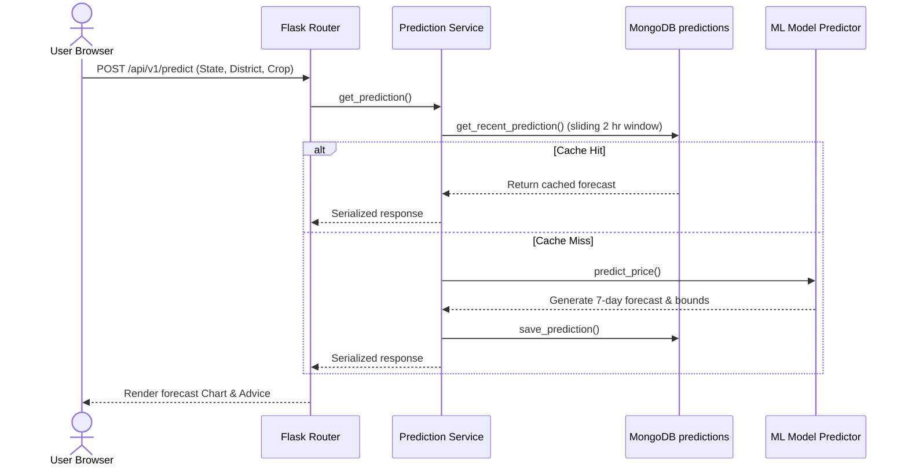

# System Design Document - AgroPulse

## 1. System Architecture
AgroPulse is designed as a three-tier web application optimized for quick read lookups and model prediction responses.

- **Presentation Layer**: Jinja2-rendered HTML templates utilizing vanilla JavaScript, Chart.js for data visualization, and Bootstrap for layout responsiveness.
- **Application Layer**: Flask application hosting modular routing controllers (blueprints), middleware filters (Flask-Limiter, CORS, Flask-Mail), and a business logic service layer.
- **Database & Model Layer**: MongoDB collection abstractions managed through a Singleton pymongo connection driver.

## 2. Component Design & Interactions

## 3. Machine Learning Model Architecture
- **Algorithm**: Random Forest Regressor (300 estimators, max depth 12).
- **Features**: Label-encoded values for `state`, `district`, and `crop` columns.
- **Inference Forecast Method**: Generates a 7-day trend based on seasonal coefficients (Rabi, Kharif, Zaid) added to the model's base crop valuation.
- **Confidence Intervals**: Computed dynamically by applying a scaling margin to the model's Mean Absolute Error (MAE).

## 4. Cache Policy
- Cached prediction items expire after **2 hours**.
- Stored fields: `crop`, `location`, `predicted_prices`, `trend`, `optimal_day`, `confidence`, `current_price`, and `created_at`.
